<div align="center">

  <h1 style="font-size: larger;">
    
    <strong>Guía Definitiva de Starknet-Es Cairo 1</strong> 
    
  </h1>
</div>

## Recursos oficiales

- Puede encontrar las notas originales [aquí](https://bit.ly/starkmaths2023)
- Puede encontrar Traducciones de documentos oficiales de MATHS Starkware [aquí](https://github.com/Starknet-Es/Maths-StarknetEs/blob/main/Gu%C3%ADas%20Oficiales/Readme.md)
- Puede encontrar Guías completas desde Starknet-Es [aquí](https://github.com/Starknet-Es/Maths-StarknetEs/blob/main/Gu%C3%ADas%20Completas/Readme.md)

## Temas

- [Configuración de su entorno de desarrollo de Starknet](#configuración-de-su-entorno-de-desarrollo-de-starknet)
    - [Pre-requisitos](#pre-requisitos)
    - [Git](#git)
    - [Python3.9](#python39)
    - [Rust](#rust)
- [Instalación de la CLI de Starknet](#instalación-de-la-cli-de-starknet)
    - [Configure su entorno virtual](#configure-su-entorno-virtual)
    - [Usando venv](#usando-venv)
    - [Usando pyenv](#usando-pyenv)
- [Instale las dependencias SO](#instale-las-dependencias-so)
    - [Ubuntu](#ubuntu)
    - [Mac](#mac)
- [Instale la CLI de Starknet](#instale-la-cli-de-starknet)
- [Instalación del compilador Cairo](#instalación-del-compilador-cairo)
    - [Agrega los ejecutables de Cairo a tu variable de entorno PATH](#agrega-los-ejecutables-de-cairo-a-tu-variable-de-entorno-path)
    - [Actualizar Compilador Cairo](#actualizar-compilador-cairo)
- [Configuración de Docker para el desarrollo de Starknet](#configuración-de-docker-para-el-desarrollo-de-starknet)
    - [Configuración de tu entorno de shell para Cairo](#configuración-de-tu-entorno-de-shell-para-cairo)
    - [Ejecutar el contenedor de Docker](#ejecutar-el-contenedor-de-docker)
    - [Verificar la instalación](#verificar-la-instalación)
- [Instalación de Cairo con un script (Instalador por Fran)](#instalación-de-cairo-con-un-script-instalador-por-fran)
    - [Para bash](#para-bash)
    - [Para Zsh](#para-zsh)
    - [Reinicia tu shell](#reinicia-tu-shell)
    - [Actualización](#actualización)
    - [Desinstalación](#desinstalación)
    - [Versiones](#versiones)
- [VS Code](#vs-code)
- [Despliegue de contratos Starknet](#despliegue-de-contratos-starknet)
    - [Configuración de variables de entorno](#configuración-de-variables-de-entorno)
    - [Configuración de una cuenta](#configuración-de-una-cuenta)
    - [Crear una nueva cuenta](#crear-una-nueva-cuenta)
    - [Financiar Cuenta](#finanzciar-cuenta)
    - [Desplegar Cuenta](#desplegar-cuenta)
    - [Compilar](#compilar)
    - [Declaración](#declaración)
    - [Despliegue](#despliegue)
    - [Interactuar](#intercatuar)


---

## Configuración de su entorno de desarrollo de Starknet
Desde Starknet Español le guiamos a través de la configuración de su entorno de desarrollo para Cairo y Starknet. El objetivo es proporcionarle las herramientas necesarias para construir, implementar e interactuar con contratos inteligentes de Cairo en la red de Starknet. Instalaremos el compilador de Cairo, una herramienta fundamental para esta tarea, y la Interfaz de Línea de Comandos (CLI) de Starknet, una utilidad para interactuar con la red de Starknet.

1. La CLI de Starknet es una interfaz de línea de comandos que le permite interactuar con Starknet. Esta es una de las herramientas que nos permiten interactuar con Starknet, sin embargo, no es la única. Cubriremos otras herramientas en capítulos posteriores (por ejemplo, el SDK de Starknet para JavaScript/Python/Rust o Protostar).

2. El compilador de Cairo es una herramienta que compila código de Cairo a Sierra.

El proceso de configuración se puede realizar a través de dos métodos diferentes: configurar un entorno de desarrollo local o utilizar un contenedor de Docker. 

## Pre-requisitos
Antes de continuar, asegúrese de tener instalados los siguientes pre-requisitos en su sistema:

### Git
[Git:](https://git-scm.com/) Será necesario tener `Git` instalado. A continuación, se muestra el comando para instalar `Git` en Ubuntu. Recuerda verificar las versiones disponibles para tu sistema operativo en el enlace proporcionado:

```bash
apt-get install git
```

Si se produce un error y te solicita entrar como administrador, agrega `sudo` al principio del comando. Se abrirá una ventana para ingresar tu contraseña (que será invisible) y luego puedes presionar Enter para continuar.

```bash
sudo apt-get install git
```

### Python3.9
[Python 3.9](https://www.python.org/downloads/release/python-390/) - Primero revise la versión que se encuentra en siu sitema operativo, si ya de serie dispone una versión posterior en Linux por ejemplo, no hacer nada ya luego ajustamos con entornos virtuales, revise su versión:

```bash
python3 --version
```


### Rust
[Rust](https://www.rust-lang.org/tools/install) - Les recomendamos revisar el enlace proporcionado para obtener más información sobre la instalación de Rust. A continuación, se muestra el comando recomendado para la instalación de `rustup` en macOS y Linux. Si deseas utilizar otros métodos de instalación, te recomendamos consultar la documentación oficial.

```bash
curl --proto '=https' --tlsv1.2 -sSf https://sh.rustup.rs | sh
```

Para revisar la instalación ha ido correctamente revise su versión:

```bash
rustc --version
```


En caso de dificultades anterirores también puede instalar una versión estable de Rust con los comandos:

```bash
rustup override set stable && rustup update
```

---

## Instalación de la CLI de Starknet
Para instalar la CLI de Starknet, siga estos pasos:

## Configure su entorno virtual:
Recomendamos trabajar dentro de un entorno virtual de Python. Esto aislará las dependencias de su proyecto de la instalación global de Python en su sistema. Para crear y activar un entorno virtual, puede usar venv o pyenv, para esta guía seguiremos `pyenv` aunque le dejaremos ambos ajustes:

### Usando venv:
Cree un entorno virtual llamado `cairo_venv`

```bash
python3.9 -m venv ~/cairo_venv
```

Active el entorno virtual

```bash
source ~/cairo_venv/bin/activate
```

### Usando pyenv:
Instale pyenv

```bash
curl https://pyenv.run | bash
```

Agregue las siguientes líneas a su .bashrc o .zshrc

```bash
export PATH="$HOME/.pyenv/bin:$PATH"
eval "$(pyenv init -)"
eval "$(pyenv virtualenv-init -)"
```


Reinicie su terminal y ejecute los siguientes comandos

```bash
pyenv install 3.9.0
pyenv virtualenv 3.9.0 cairo_venv
pyenv activate cairo_venv
```

Activar el entorno virtual

```bash
pyenv activate cairo_venv
```

Después de crear y activar el entorno virtual, debería ver (cairo_venv) en el indicador de línea de comando, lo que indica que el entorno virtual está activo, por ejemplo: `(cairo_venv) nadai@nadai:`


Ahora puede revisar que su vesión de python si es la que hemos requerido y necesita por ahora.

```bash
python --version
```


## Instale las dependencias SO:
Antes de instalar la CLI de Starknet, debe instalar algunas dependencias específicas del sistema. Siga las instrucciones para su sistema operativo:

### Ubuntu:
```bash
sudo apt install -y libgmp3-dev
```

### Mac:
```bash
brew install gmp
```

Una vez que haya instalado las dependencias específicas del sistema, proceda a instalar los paquetes de Python requeridos para la CLI de Starknet:

```bash
pip install ecdsa fastecdsa sympy
```

Estos paquetes de Python proporcionan funcionalidad criptográfica y matemática necesaria para la CLI de Starknet.

---

## Instale la CLI de Starknet:
Ahora que ha configurado el entorno e instalado las dependencias, puede instalar la CLI de Starknet. Siga estos pasos:

1. Desinstale cualquier versión anterior de cairo-lang (cairo-lang es el nombre del paquete que contiene la CLI de Starknet):

```bash
pip uninstall cairo-lang
```

Instale la última versión de cairo-lang:

```bash
pip install cairo-lang
```

Después de haber instalado la CLI de Starknet, verifique su instalación comprobando la versión, pero recuerde entrar en su entorno virtual


```bash
starknet --version
```


En este caso de comprobación de version puede usar `-v` o `--version`, si quiere acceder a la última version publicada revise [Cairo-Lang Releases](https://github.com/starkware-libs/cairo-lang/releases)


Si recibes el siguiente error:

```bash
ImportError: urllib3 v2.0 only supports OpenSSL 1.1.1+, currently the 'ssl' module is compiled with LibreSSL 2.8.3. See: https://github.com/urllib3/urllib3/issues/2168
```

Intenta reducir la versión de urllib3:

```bash
pip install urllib3==1.26.6
```

Luego, verifica la versión nuevamente:

```bash
starknet --version
```


La salida debería mostrar la versión instalada de Starknet CLI. Asegúrate de que la versión coincida con la última versión publicada.

Para actualizar a la última versión de Starknet CLI, ejecuta el siguiente comando:

```bash
pip install cairo-lang --upgrade
```

---

## Instalación del compilador Cairo
Para instalar el compilador Cairo, sigue estos pasos:

1. Ahora procederemos a clonar y configurar nuestro compilador de Cairo. Primero, asegúrate de estar en la raíz de tu directorio `$HOME`.
```bash
cd ~/
```

2. Clona el repositorio del compilador Cairo en una carpeta llamada `.cairo` en tu directorio principal:
```bash
git clone https://github.com/starkware-libs/cairo/ .cairo
```

3. Cambia a la rama de trabajo y genera los binarios de la versión:
```bash
cd .cairo/
git checkout tags/v1.1.0
cargo build --all --release
```

## Agrega los ejecutables de Cairo a tu variable de entorno PATH:
Actualiza tu archivo .bashrc o .zshrc para agregar los binarios de Cairo a tu variable de entorno PATH:

```bash
export PATH="$HOME/.cairo/target/release:$PATH"
```


Abre una nueva terminal y verifica que el siguiente comando devuelva un número de versión:

```bash
cairo-compile --version
```


## Actualizar Compilador Cairo

Para actualizar el compilador Cairo, solo necesitamos cambiar a la etiqueta más reciente. Ejecuta los siguientes comandos:

1. Ve al repositorio clonado de Cairo
```bash
cd ~/.cairo
```

2. Obtén las etiquetas más recientes
```bash
git fetch
```
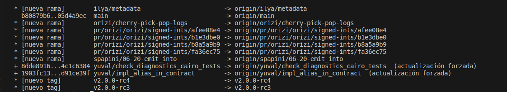

3. Cambia a la etiqueta más reciente
```bash
git checkout tags/v2.0.0-rc4
cargo build --all --release
```


4. Abre una nueva terminal y verifica que tengas la versión deseada:

```bash
cairo-compile --version
```


Ahora tenemos nuestro cairo-compile listo en la última versiíon disponible, no significa que sea la más estable, a día 21-06-2023 no se ha lanzado la 0.12, la cual será necesaria para poder compilar nuestro contratos y desplegar de la versión del cimpilador 2.X, en este caso vemos que es la `v2.0.0-rc4`

Así que ahora lo que tenemos que volver hacer es volver a la versión `v1.1` con los comandos

```bash
git checkout tags/v1.1.0
cargo build --all --release
``` 


Ahora puedes volver a comprobar tu versión y ya tienes configurado tu entorno de desarrollo local para Starknet. Ahora puedes comenzar a construir, implementar e interactuar con contratos inteligentes en Cairo.


---

# Configuración de Docker para el desarrollo de Starknet
El uso de un entorno Docker para el desarrollo de Starknet ofrece varias ventajas en comparación con la configuración del entorno de desarrollo de forma local. Estas ventajas incluyen:

- **Aislamiento**: Los contenedores de Docker proporcionan un entorno aislado para el desarrollo de Starknet, asegurando que las dependencias y configuraciones no interfieran con otros proyectos o con la configuración global del sistema.

- **Portabilidad**: Un contenedor de Docker puede ejecutarse en cualquier sistema con Docker instalado, lo que te permite compartir fácilmente tu entorno de desarrollo con otros o moverlo entre diferentes máquinas sin tener que volver a configurar el entorno desde cero.

- **Reproducibilidad**: Las imágenes de Docker aseguran que tu entorno de desarrollo sea consistente en diferentes sistemas, lo que ayuda a eliminar problemas derivados de diferencias en las dependencias o configuraciones.

- **Versionado**: Puedes utilizar diferentes imágenes o etiquetas de Docker para diferentes versiones de las herramientas de desarrollo de Starknet, lo que te permite cambiar fácilmente entre versiones según sea necesario.

- **Gestión más sencilla**: Docker simplifica la gestión de entornos de desarrollo, permitiéndote iniciar, detener y reiniciar contenedores con facilidad. También facilita la limpieza de tu entorno eliminando contenedores e imágenes.

Teniendo en cuenta estas ventajas, las siguientes secciones te guiarán en la configuración de un entorno Docker para el desarrollo de Starknet. Este entorno te permitirá construir, implementar e interactuar fácilmente con contratos inteligentes en Cairo utilizando Docker.

Antes de continuar, asegúrate de tener los siguientes requisitos previos instalados en tu sistema:

- [Docker](https://www.docker.com/)

## Descargar la imagen de Docker
El primer paso es descargar la imagen de Docker que contiene las herramientas necesarias para el desarrollo de Starknet. Ejecuta el siguiente comando en tu terminal:

```bash
docker pull artudev19/cairo-env:latest
```

Este comando descarga la imagen de Docker de Starknet.

## Ejecutar el contenedor de Docker
Para ejecutar un contenedor a partir de la imagen, ejecuta el comando `docker run`. Para mantener cierta información persistente, utiliza un volumen pasando la opción `-v from_host_path:to_container_path`. Esto reflejará el contenido de `from_host_path` dentro del contenedor. Si especificas una ruta en el contenedor que no existe, Docker la creará automáticamente.

```bash
docker run -it --name stark-env -v /Desktop/stark-apps/contracts:/contracts artudev19/cairo-env:latest
```

Este comando ejecuta un contenedor llamado `stark-env` (asegúrate de que tu demonio de Docker esté en ejecución) y abre una terminal donde puedes ejecutar comandos de Starknet y Cairo. En el ejemplo anterior, los contratos de Cairo de tu máquina local estarán en el directorio `stark-app/contracts`, mientras que en el contenedor estarán en la ruta `contracts`.

## Verificar la instalación
Verifica las versiones instaladas de Starknet CLI y el compilador Cairo:

```bash
starknet --version
cairo-compile --version
```

La salida debería mostrar la versión instalada de Starknet CLI y el compilador Cairo. Asegúrate de que las versiones coincidan con la última versión

---

# Instalación de Cairo con un script (Instalador por Fran)
Como último metodo de instalación seguiremos el script de Fran. Si deseas instalar una versión específica de Cairo en lugar de la última versión, establece la variable de entorno `CAIRO_GIT_TAG` (por ejemplo, exporta `CAIRO_GIT_TAG=v1.1.0`), corra el siguiente comando:

```bash
curl -L https://github.com/franalgaba/cairo-installer/raw/main/bin/cairo-installer | bash
```

Después de la instalación, sigue estas instrucciones para configurar tu entorno de shell.

## Configuración de tu entorno de shell para Cairo
* Define la variable de entorno `CAIRO_ROOT` para que apunte a la ruta donde Cairo almacenará sus datos. Por defecto, es `$HOME/.cairo`. Si instalaste Cairo mediante la clonación de Git, te recomendamos que lo establezcas en la misma ubicación donde lo clonaste.
* Agrega los ejecutables `cairo-*` a tu `PATH` si aún no están allí.

La siguiente configuración debería funcionar para la gran mayoría de los usuarios en casos de uso comunes.

## Para bash
Los archivos de inicio predeterminados de Bash varían ampliamente entre distribuciones en cuanto a cuál de ellos carga qué, en qué circunstancias, en qué orden y qué configuración adicional realizan. Por lo tanto, la forma más confiable de tener Cairo en todos los entornos es agregar los comandos de configuración de Cairo tanto a `.bashrc` (para shells interactivos) como al archivo de perfil que Bash utilizaría (para shells de inicio de sesión).

Primero, agrega los comandos a `~/.bashrc` ejecutando lo siguiente en tu terminal:

```bash
echo 'export CAIRO_ROOT="$HOME/.cairo"' >> ~/.bashrc
echo 'command -v cairo-compile >/dev/null || export PATH="$CAIRO_ROOT/target/release:$PATH"' >> ~/.bashrc
```

Luego, si tienes `~/.profile`, `~/.bash_profile` o `~/.bash_login`, agrega los comandos también allí. Si no tienes ninguno de estos, agrégalos a `~/.profile`.

* Para agregar a ~/.profile:

```bash
echo 'export CAIRO_ROOT="$HOME/.cairo"' >> ~/.profile
echo 'command -v cairo-compile >/dev/null || export PATH="$CAIRO_ROOT/target/release:$PATH"' >> ~/.profile
```

* Para agregar a ~/.bash_profile:

```bash
echo 'export CAIRO_ROOT="$HOME/.cairo"' >> ~/.bash_profile
echo 'command -v cairo-compile >/dev/null || export PATH="$CAIRO_ROOT/target/release:$PATH"' >> ~/.bash_profile
```
    
## Para Zsh

```bash
echo 'export CAIRO_ROOT="$HOME/.cairo"' >> ~/.zshrc
echo 'command -v cairo-compile >/dev/null || export PATH="$CAIRO_ROOT/target/release:$PATH"' >> ~/.zshrc
```

Si deseas tener Cairo en shells de inicio de sesión no interactivos, también agrega los comandos a `~/.zprofile` o `~/.zlogin`.

Para el shell Fish:

Si tienes Fish 3.2.0 o una versión más reciente, ejecuta lo siguiente de forma interactiva:

```bash
set -Ux CAIRO_ROOT $HOME/.cairo
fish_add_path $CAIRO_ROOT/target/release
```

De lo contrario, ejecuta el fragmento de código a continuación:

```bash
set -Ux CAIRO_ROOT $HOME/.cairo
set -U fish_user_paths $CAIRO_ROOT/target/release $fish_user_paths
```

En MacOS, es posible que también desees instalar [Fig](https://fig.io/), que proporciona completaciones de shell alternativas para muchas herramientas de línea de comandos con una interfaz emergente similar a un IDE en la ventana del terminal. (Ten en cuenta que sus completaciones son independientes de la base de código de Cairo, por lo que pueden estar ligeramente desactualizadas para cambios de interfaz muy recientes).

## Reinicia tu shell
Para que los cambios en el PATH surtan efecto.

```bash
exec "$SHELL"
```

## Actualización
En caso de querer actualizar correr el comando

```bash
rm -fr ~/.cairo
curl -L https://github.com/franalgaba/cairo-installer/raw/main/bin/cairo-installer | bash
```

## Desinstalación
Cairo se instala en `$CAIRO_ROOT` (por defecto: `~/.cairo`). Para desinstalarlo, simplemente elimínalo:

```bash
rm -fr ~/.cairo
```

Luego, elimina estas tres líneas de su `.bashrc`:

```bash
export PATH="$HOME/.cairo/target/release:$PATH"
```

Y por último, reinicia tu shell:

```bash
exec $SHELL
```

## Versiones
Una vez tenga todo configurado puede comprobar sus versiones instaladas con los siguientes comadnos por independiente o conjunto como hemos visto a lo largo de la instalación

```bash
starknet --version
cairo-compile --version
starknet-compile --version
```

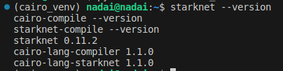

---

# VS Code 
Ahora, si creamos un contrato de prueba, veremos que la sintaxis no es reconocida por nuestro programa de VS Code.


Pero ya tenemos disponible la extensión de Cairo 1 para VS Code. Para configurarla, primero debemos descargarla e instalarla buscando `Cairo1` de StarkWare y haciendo clic en `install`.


También es posible que necesite reconstruir su `cairo-language-server`. Para hacerlo, vaya a la ubicación de instalación de Cairo y ejecute:

```bash
cd .cairo
cargo build --bin cairo-language-server --release
```


Una vez instalada, iremos a los ajustes para agregar la ruta de nuestro `cairo-language-server`, que se encuentra dentro de la ruta `/home/nadai/.cairo/target/release/cairo-language-server`. Deberá buscar su ruta exacta y reemplazar esta.


Luego, deberá pegar la ruta en los ajustes de su Extensión instalada del `Cairo-languague-server` que encontró en `/path/cairo/target/release/cairo-language-server` (sustituir usuario y revisar ruta de instalación). Una vez copiado y establecido, deberá recargar con F5 su Visual Studio y ya debería estar activo. Si no es así, cierre y abra para volver a visualizarlo.


Ahora su contrato de Cairo 1 debería ser reconocido con la sintaxis de la versión que haya configurado.


Puede seguir nuevas actualizaciones y configuraciones desde el link oifcial de [StarkWare VS-Code](https://github.com/starkware-libs/cairo/blob/main/vscode-cairo/README.md)

---

# Despliegue de contratos Starknet
Ahora veremos como crear una contrato de cuenta, como se controlan estas cuentas, compilar, declarar, desplegar e interactuar con los Contracts que tenemos en Cairo 1.

## Configuración de variables de entorno
Los siguientes comandos deben ejecutarse cada vez que abras un nuevo terminal para interactuar con Starknet. Configurarlos te ahorrará tiempo cuando utilices la CLI dentro de la misma sesión del terminal.

* Utilizar la red de prueba de Starknet

```bash
export STARKNET_NETWORK=alpha-goerli
```

* Establecer la implementación predeterminada de la billetera que se utilizará en la CLI

```bash
export STARKNET_WALLET=starkware.starknet.wallets.open_zeppelin.OpenZeppelinAccount
```

Establecer la ruta al compilador binario de Cairo 1. Ajusta esta ruta según tu instalación si es necesario

```bash
export CAIRO_COMPILER_DIR=~/.cairo/target/release/
```

* Argumentos del compilador
```bash
export CAIRO_COMPILER_ARGS=--add-pythonic-hints
```

Inicialemnte se puede pasar todo junto de la siguiente manera

```bash
# Use Starknet testnet
export STARKNET_NETWORK=alpha-goerli
# Set the default wallet implementation to be used by the CLI
export STARKNET_WALLET=starkware.starknet.wallets.open_zeppelin.OpenZeppelinAccount
# Set the path to the cairo 1 compiler binary. Adapt this path to fit your installation if needed
export CAIRO_COMPILER_DIR=~/.cairo/target/release/
# Compiler arguments
export CAIRO_COMPILER_ARGS=--add-pythonic-hints
```

Aunque normalmente los errores comunes en estos casos son al volver a iniciar sesión así que si tiene algunos de estos dos errores, pase los `EXPORT` correspondientes

```bash
Error: AssertionError: A wallet must be specified (using --wallet or the STARKNET_WALLET environment variable), unless specifically using --no_wallet.
```

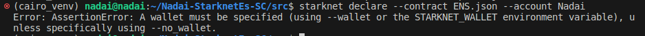


```bash
The network is unknown. The default list of allowed libfuncs will be used. To specify the network, pass '--network' or set the STARKNET_NETWORK environment variable.
Error: Exception: feeder_gateway_url must be specified with the "declare" subcommand.
Consider passing --network or setting the STARKNET_NETWORK environment variable.
```

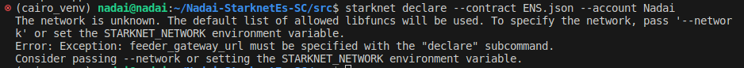

Ambos se deben a la falta de exportar `STARKNET_NETWORK` y `STARKNET_WALLET` se soluciona pasando de nuevo los comandos:

```bash
export STARKNET_NETWORK=alpha-goerli
export STARKNET_WALLET=starkware.starknet.wallets.open_zeppelin.OpenZeppelinAccount
```

## Configuración de una cuenta
Debes configurar tu CLI con un contrato de cuenta y financiarlo.

Las cuentas de Starknet son contratos inteligentes. Como tal, crear una implica enviar una transacción y lleva un poco más de tiempo que crear una EOA en otras redes. 

Este proceso consta de tres pasos:

1. Generar localmente la dirección de tu cuenta

2. Financiarla

3. Desplegarla

Las cuentas de Starknet declaradas a través de la CLI se almacenan en tu máquina en la carpeta `~/.starknet_accounts/` en la que podremos revisar su estado o ver los nombres y redes de las cuentas que tenemos.

Para poder visualizar estas carpeta ocultas en los SO, en ubuntu bastará con tocar `Crtl+H` y os aparecerán estas carpetas, como `.cairo`, es decir todas con `.` estás ocultas.

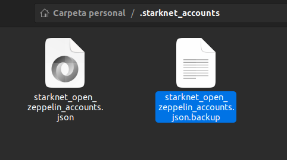

## Crear una nueva cuenta
En este paso emepzaremos a crear nuestra nueva cuenta que inicialmente solo será calculada veamos, de hecho, podemos hacerlo sin concción a internet ya que sólo será el procedimiento de generar nuesta Private y Public Key:

```bash
starknet new_account --account NadaiTest
```

Tu terminal devolverá la dirección de tu cuenta.

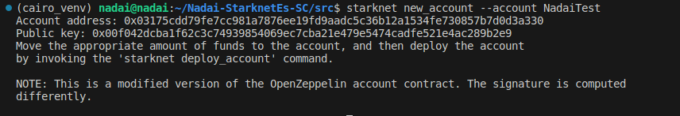

Y podremos comprobar en nuestro archivo `starknet_open_zeppelin_accounts.json` que nuestra nueva ya aparece con un estado de `false` (aun no ha sido desplegado)

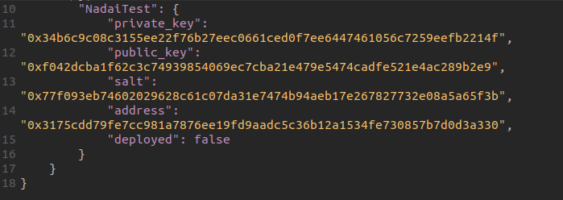

Pero si nos detecta aunque estemos `sin conección a la red` la cuenta creada, por lo que si pasamos el mismo comando nos daría el siguiente error

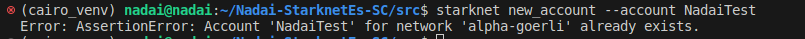

Pero ¿Qué pasaría si borramos nuestra cuenta que ha sido calculada pero no desplegada?¿Nos daría los mismo valores? Vamos a probar, borremos la cuetna que aún no ha sido desplegada

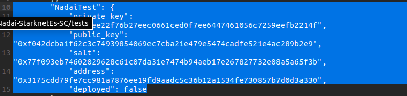

- Account address: 0x03175cdd79fe7cc981a7876ee19fd9aadc5c36b12a1534fe730857b7d0d3a330

Y volvemos a correr el comando para desplegar nuestra cuenta que antes no s daba error como cuenta ya existente:

```bash
starknet new_account --account NadaiTest
```

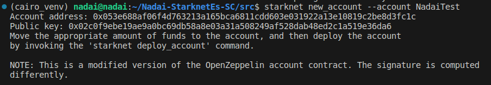

Vemos como se ha generado una cuenta, una private key, public key completamente nueva asociado a nuestro nombre.

- Account address: 0x053e688af06f4d763213a165bca6811cdd603e031922a13e10819c2be8d3fc1c

## Finanzciar Cuenta
Primero aclaremos que estas cuentas son una versión modificada del contrato de cuenta de OpenZeppelin. La firma se calcula de manera diferente.

Ahora necesitamos tener fondos en esa cuenta que ha sido sólo calculda, moveremos la cantidad adecuada de fondos a la cuenta para luego desplegar nuestra cuenta invocando el comando `starknet deploy_account`.

- Utiliza el [faucet](https://faucet.goerli.starknet.io/) para obtener fondos y enviarlos a la cuenta.
- Transfiere fondos utilizando [Starkgate](https://goerli.starkgate.starknet.io/).
- Transfiere fondos de otra cuenta.

En este caso usamos faucet

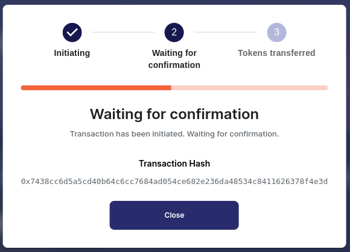

Sin importar cómo lo hagas, asegúrate de que la transacción de financiación alcance el estado `PENDING` antes de continuar. Puedes verificarlo en [Starkscan](https://testnet.starkscan.co/), [Voyager](https://goerli.voyager.online/) o como aprenderemos en este caso a directamente con la CLI, y comprobar como nuestro estado de despliegue pasa de `false` a `true`

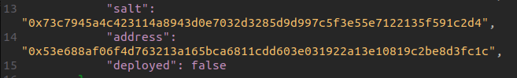

El hash de la [transacción del faucet](https://testnet.starkscan.co/tx/0x7438cc6d5a5cd40b64c6cc7684ad054ce682e236da48534c8411626378f4e3d#overview)) será el que usemos para ver el estado de nuestro envio de saldo para poder desplegar, también puede hacerlo desde los explodaroes mencionados

```bash
starknet get_transaction --hash 0x7438cc6d5a5cd40b64c6cc7684ad054ce682e236da48534c8411626378f4e3d
```

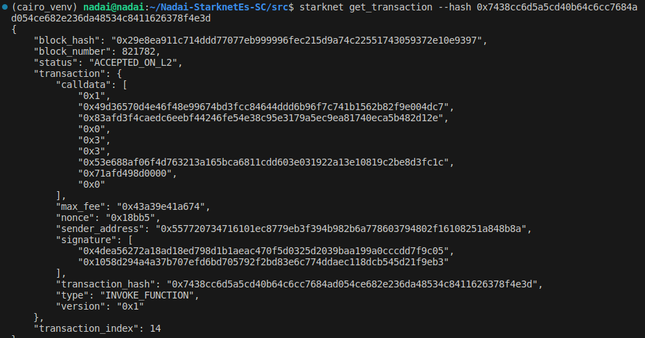

En este caso vemos que ya ha sido aceptada en L2 `ACCEPTED_ON_L2`, asi que procedamos a desplegar la cuenta


# Desplegar Cuenta
Ahora ya podemos desplegar nuestra cuenta con el comando y el nombre de la cuenta, en este caso `NadaiTest`

```bash
starknet deploy_account --account NadaiTest
```

Tu resultado de muestra debería verse algo así:

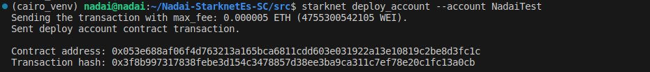

Y ya podriamos comprobar que nuesto estado de cuenta ha cambiado `true` y ya definitivamente se encuentra desplegado.

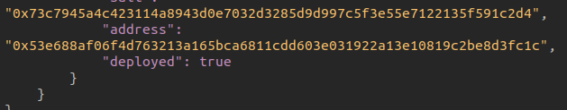

* [Hash NadaiTest](https://testnet.starkscan.co/contract/0x053e688af06f4d763213a165bca6811cdd603e031922a13e10819c2be8d3fc1c)

Como ultima comprobación antes de empezar con nuestro Contratos de Cairo 1, veamos como nuestra cuenta ya se sitúa con una transación y por lo tanto el `nonce 1` desde la CLI

```bash
starknet get_nonce --contract_address 0x053e688af06f4d763213a165bca6811cdd603e031922a13e10819c2be8d3fc1c
```

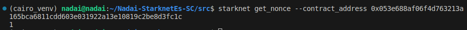


## Compilar
Para compilar nuestros Contratos de Cairo 1, primero crearemos en nuestro proyecto una carpeta para añadir los contratos `src` así que si ha clonado este repo, primero ejecute:

```bash
cd src
```

Ahora se encotrará en la carpeta de Contratos, primero personalice el contrato que usaremos de prueba [Hola.cairo](/src/Hola.cairo) y agregaremos un nuevo tipo de evento. Encuentre un nombre que sea único (esto es importante). Agregue el siguiente código:

```cairo
#[event]
fn Escoga_Evento_Unico(from:ContractAddress, value:felt252) {}
```

Ahora procederemos a compilar nuestro contrato de prueba [Hola.cairo](/src/Hola.cairo), el cual nos generará si todo va bien el archivo `.json` necesario para los siguientes paso, primero añadimos el comando, seguido del nombre del contrato que queremos compilar y el nombre de salida a `.json`

```bash
starknet-compile Hola.cairo Hola.json
```

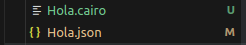

## Declaración
Los contratos en Starknet tiene la ventaja de poder ser declarados en la red una vez y luego sólo desplegar, veremos posterior como no puede declararse dos contratos iguales. En Starknet, el proceso de implementación consta de dos pasos:

* Declarar la clase de su contrato o enviar el código de su contrato a la red.
* Implementar un contrato o crear una instancia del código que declaró anteriormente.

Comencemos con la declaración del código anterior.

```bash
starknet declare --contract Hola.json --account NadaiTest
```


* [Link Transacción Declare Class Hass](https://testnet.starkscan.co/class/0x610a4a6c84d011ca0013b9df30014ef978b0c9307d23fea2821d13fe4c1035d)

Una vez su declaración haya sido aceptada ya su class hash aparecerá en el explorador, puede revisar el estado con el comando:

```bash
starknet get_transaction --hash 0x610a4a6c84d011ca0013b9df30014ef978b0c9307d23fea2821d13fe4c1035d
```

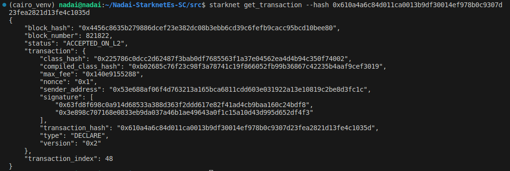

Desde el explorador podemos comprobar que aún no se ha desplegado ningún contrato usando esta declaración

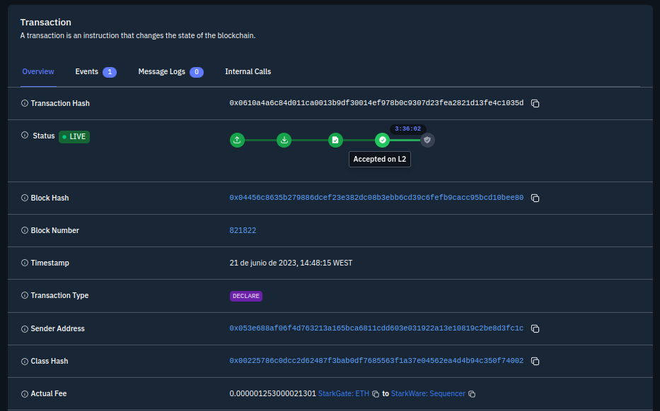

## Despliegue
El hash de transacción le permite rastrear cuándo la red habrá recibido el código de su contrato. Una vez que esta transacción pase a `PENDING` (pendiente), puede implementar una instancia de su contrato.

Utilizando el `class hash` generado anteriormente, implemente el contrato. Si encuentra algún problema relacionado con las tarifas, agregue el indicador `--max_fee 100000000000000000` a sus comandos de CLI para establecer un límite de gas arbitrariamente alto para su transacción de implementación.

Así que para desplegar su primer contrato en Cairo 1, de una ejemplo sencillo sin `inputs` corra el comando:

```bash
starknet deploy --class_hash 0x225786c0dcc2d62487f3bab0df7685563f1a37e04562ea4d4b94c350f74002  --account NadaiTest
```

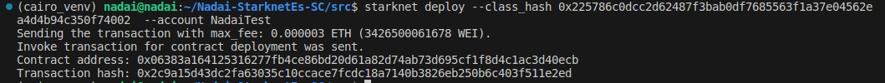

- [Contract Hola](https://testnet.starkscan.co/contract/0x06383a164125316277fb4ce86bd20d61a82d74ab73d695cf1f8d4c1ac3d40ecb#read-write-contract)

Si todo ha ido bien ya podra revisar su contrato, puede revisar esta implentación y dejar su mensaje de bienvenida, pero para ello primero deberá de usar un convertidor a `felt`, en esta caso usamos [Stark-Utils](https://www.stark-utils.xyz/converter) y el mensaje que querenmos convertir.

- Mensaje = Starknet La Mejor L2 😜 
- Felt = 523853089324632803106236192193517396970156379196793374498332

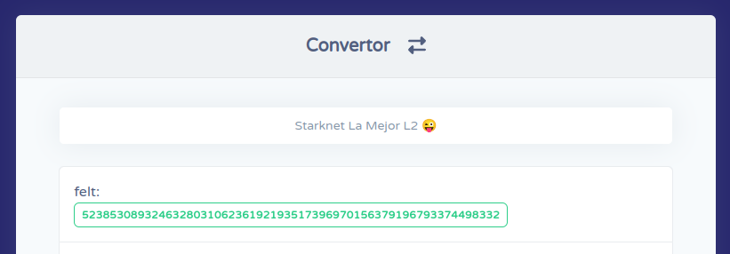

Podríamos directamente al explorador y contrato que hemos desplegado, conectar nuestra cuenta de `ArgentX` o `Braavos` que queramos y dejar nuestro mensaje a `Hola_Starknianos_Dice`.

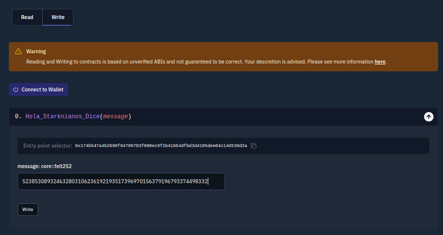

## Intercatuar
Esta vez vamos hacer un `invoke` de la transacción desde la CLI. La sintaxis para invocar una función en su contrato es la siguiente:

```bash
starknet invoke --function <nombre de la función> --address <dirección del contrato implementado> --account <nombre_de_cuenta>
```

En nuestro caso añadimos la dirección del contrato que acabamos de desplegar `0x06383a164125316277fb4ce86bd20d61a82d74ab73d695cf1f8d4c1ac3d40ecb` las input, que han sido el saludo convertido a felt `523853089324632803106236192193517396970156379196793374498332` y nuestra cuenta de test `NadaiTest`

```bash
starknet invoke --function Hola_Starknianos_Dice --address 0x06383a164125316277fb4ce86bd20d61a82d74ab73d695cf1f8d4c1ac3d40ecb --input 523853089324632803106236192193517396970156379196793374498332 --account NadaiTest
```


Ahora podrá revisar en el explorador el evento y el mensaje que hemos dejado, en este caso:

- [Hash mensaje](https://testnet.starkscan.co/tx/0x048e937dccd2af467feda07a83cb6c658ab13804857f7eda4a6218e7df0891ea)
- [Eventos](https://testnet.starkscan.co/contract/0x06383a164125316277fb4ce86bd20d61a82d74ab73d695cf1f8d4c1ac3d40ecb#events)

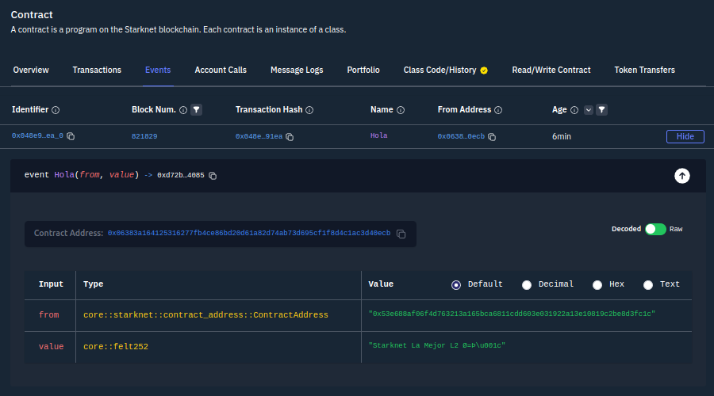

---

# Test
Si queremos ver el potencial que trae Cairo incorporado, es la facilidad y capacidad de pasar test, para ello primero iremos a la carpeta `tests` que tenemos con algunos ejemplos, aunque también puede hacer desde la raíz del proyecto y se marcan para identificar que son pruebas con `#[cfg(test)]`

* [Suma](/tests/suma.cairo)


```bash
cairo-test suma.cairo
```

o

```bash
cairo-test ./tests/suma.cairo
```

Si el resultado es correcto:


En caso de error en el resultado:


test

contratos de prueba

guias 1010
guias 721
guias erc20
guias accounts
guias bridge

comadnos cli de Starknet
